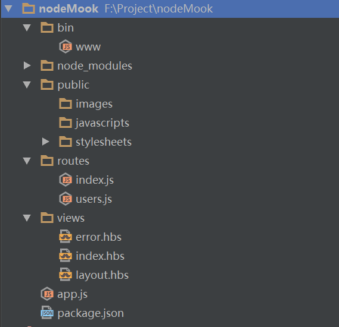

title: 06. Express 高级
speaker: LI YANG
url: 
transition: slide3
files: /js/demo.js,/css/demo.css
theme: dark
usemathjax: yes

--
# Express 基本模型
## Express basic modle

### 工程基本结构
通过Webstorm初始化之后的工程基本目录如下：
<p></p>

* bin: 项目的启动文件www
* node_modules：用来存放node的模块组件
* public：项目的静态资源
* routes：路由逻辑
* views：用来存放视图对象
* app.js：Express应用对象
* package.json：项目配置文件，包含各种所需模块以及项目的配置信息

### www文件逻辑
www是整个工程的入口函数，就像c语言的main函数一样，它是通过`package.json`来配置的（`scripts->start`参数）；
```json
{
  "name": "nodeMook",
  "version": "0.0.0",
  "private": true,
  "scripts": {
    "start": "node ./bin/www"
  }
}
```

www的主要逻辑就是创建http服务器，并且监听端口，其主要逻辑代码如下：
```js
#!/usr/bin/env node

//初始化Module
var app = require('../app');
var debug = require('debug')('learnNodeProj:server');
var http = require('http');

//设置服务器端口
var port = normalizePort(process.env.PORT || '3000');
app.set('port', port);

//创建HTTPf服务器
var server = http.createServer(app);

//服务器开始监听端口
server.listen(port);
server.on('error', onError);
server.on('listening', onListening);
```


### app.js逻辑
app是Express的主要逻辑框架，它主要包括4部分内容：

1. 初始化各种依赖模块，比如 `cookie` 、`body-parser`、`session` 等；  
2. 创建视图模板,比如`handlebar`;
3. 创建路由映射；  
4. 创建错误处理逻辑，主要包括`500错误`和`404错误`  

```js
var express = require('express');                       //express对象
var path = require('path');                             //路径对象
var favicon = require('serve-favicon');                 //图标对象
var logger = require('morgan');                         //日志对象
var cookieParser = require('cookie-parser');            //cooke对象
var bodyParser = require('body-parser');                //req的body对象

var routes = require('./routes/index');                 //index路由对象
var users = require('./routes/users');                  //user路由对象

var app = express();

app.set('views', path.join(__dirname, 'views'));        //设置视图模板存放的路径
app.set('view engine', 'hbs');                          //设置视图模板的类型为handlebar

app.use(logger('dev'));                                 //开发模式启用日志
app.use(bodyParser.json());                             //接受json请求
app.use(bodyParser.urlencoded({ extended: false }));    //接受form请求
app.use(cookieParser());                                //启用cookie解析
app.use(express.static(path.join(__dirname, 'public')));//设置静态文件路径

app.use('/', routes);                                   //设置根目录路由
app.use('/users', users);                               //设置users目录路由

//处理404错误
app.use(function(req, res, next) {
  var err = new Error('Not Found');
  err.status = 404;
  next(err);
});

//处理500错误
app.use(function(err, req, res, next) {
  res.status(err.status || 500);
  res.render('error', {
    message: err.message,
    error: {}
  });
});

module.exports = app;
```


### 与handlebars模版集成
新建好的工程默认使用的是hbs，需要安装使用express-handlebars模板；

1 . 卸载hbs,安装express-handlebars
```js
npm uninstall hbs                       //
npm install --save express-handlebars   
```

2 . 修改模版集成, 在`app.js`中添加`express-handlebars`
```js
var exphbs = require('express-handlebars');

//配置hbs基础模板和分块模板
var hbs = exphbs.create({
  partialsDir: 'views/partials',        //partialsDir: 指定partial页面的目录。
  layoutsDir: "views/layouts/",         //layouts：指定布局页面的目录
  defaultLayout: 'main',                //defaultLayout：指定默认布局文件(没带后缀)
  extname: '.hbs',                      //extname: 指定handlebars文件后缀
  helpers: hbsHelper                    //helpers: 指定模板函数对象
});
app.engine('hbs', hbs.engine);
```


### 集成Session对象
session是不可缺少的重要部分，从express4开始，session作为一个独立的中间件而不再直接集成于express框架中，需要单独安装使用。

1. 安装session
```js
npm install --save express-session
```

2. 在`app.js`中加入`session`
```js
var session = require('express-session');

app.use(session({
  name:'session-name',
  maxAge: 30 * 1000,
  secret: 'secret-key-name',
  resave: false,
  saveUninitialized: false
}));
```

### 创建全局的配置文件
为了更好的维护项目，定义一个配置文件（config.js）来定义基本信息，放到项目根目录下。
```js 
var Config = {
    site: {
        title: '前端社区',
        description: '用Coding创造财富',
        version: '1.0',
    },
    db: {
        cookieSecret: 'frontendblog',
        name: 'blog',
        host: 'localhost',
        url: 'mongodb://127.0.0.1:27017/blog'
    },
    site: {
        pagesize: 6
    }
};
module.exports = Config;
```