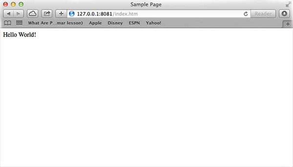

title: t04. webmodel
speaker: LI YANG
url: 
transition: slide3
files: /js/demo.js,/css/demo.css
theme: dark
usemathjax: yes


### Web Application Architecture
A Web application is usually divided into four layers

- Client: This layer consists of web browsers, mobile browsers or applications which can make HTTP requests to the web server.
- Server: This layer has the Web server which can intercept the requests made by the clients and pass them the response.
- Business:  This layer contains the application server which is utilized by the web server to do the required processing. This layer interacts with the data layer via the database or some external programs.
- Data: This layer contains the databases or any other source of data.

**Web Architecture**


### 如何创建服务器
> 1 . 创建服务器 **Server.js**

```js
var http = require('http');
var fs = require('fs');
var url = require('url');

// Create a server
http.createServer( function (request, response) {  
   // Parse the request containing file name
   var pathname = url.parse(request.url).pathname;
   
   // Print the name of the file for which request is made.
   console.log("Request for " + pathname + " received.");
   
   // Read the requested file content from file system
   fs.readFile(pathname.substr(1), function (err, data) {
      if (err) {
         console.log(err);
         // HTTP Status: 404 : NOT FOUND
         // Content Type: text/plain
         response.writeHead(404, {'Content-Type': 'text/html'});
      }else {   
         //Page found     
         // HTTP Status: 200 : OK
         // Content Type: text/plain
         response.writeHead(200, {'Content-Type': 'text/html'});    
         
         // Write the content of the file to response body
         response.write(data.toString());       
      }
      // Send the response body 
      response.end();
   });   
}).listen(8081);

// Console will print the message
console.log('Server running at http://127.0.0.1:8081/');
```


> 2 . 创建页面 **index.html**

```html
<html>
   <head>
      <title>Sample Page</title>
   </head>
   
   <body>
      Hello World!
   </body>
</html>
```

> 3 . 运行服务器 

```bash
$ node server.js

Server running at http://127.0.0.1:8081/
```

> 4 . 打开浏览器访问 `http://127.0.0.1:8081/index.htm`




### node的客户端
> 1 . 编写client.js

```js
var http = require('http');

// Options to be used by request 
var options = {
   host: 'localhost',
   port: '8081',
   path: '/index.htm'  
};

// Callback function is used to deal with response
var callback = function(response){
   // Continuously update stream with data
   var body = '';
   response.on('data', function(data) {
      body += data;
   });
   
   response.on('end', function() {
      // Data received completely.
      console.log(body);
   });
}
// Make a request to the server
var req = http.request(options, callback);
req.end();
```

> 2 . 运行客户端  

```bash
$ node client.js
```